# FPGA-Greedy-Snake

完成者：**1951247 钟伊凡 计科**

[toc]

## 项目概述

### 项目内容概括

本项目是基于Xilinx Nexys4 DDR FPGA开发板、VS1003B MP3、蓝牙、VGA和七段数码管的草丛贪吃蛇小游戏。

### 详细使用说明

#### 界面说明

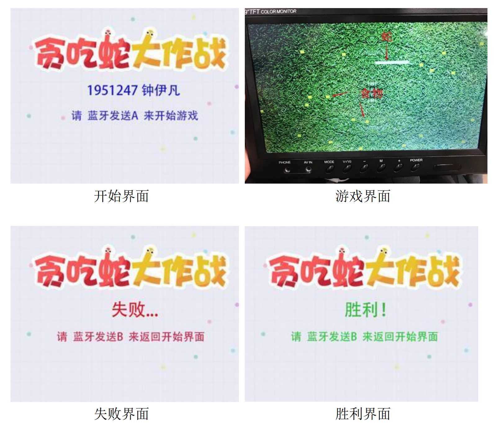

#### 按键与控制说明

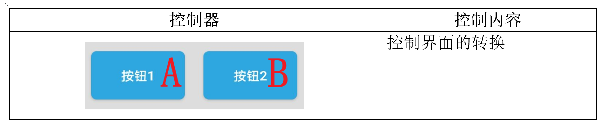

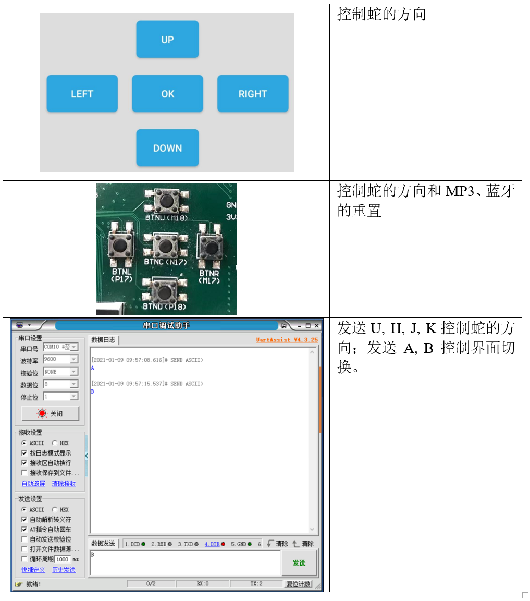

#### 详细操作说明

准备工作：用电脑或者输出电压为5V的充电宝为FPGA板供电，将FPGA板连上VGA、MP3、蓝牙，从电脑或手机等蓝牙控制端打开蓝牙串口。如果通过电脑下板，mode选择QSPI；如果SD卡下板，mode选择USB/SD，并完成下板。
	
程序下板后，将在VGA上看到开始界面。这时，通过蓝牙控制端发送A来开始游戏。
	
游戏开始，MP3将自动循环播放背景音乐，七段数码管左侧四位将显示本次游戏经过的时间，最右侧两位显示蛇的长度（初始长度为4），VGA上则会显示游戏的界面——草丛背景、白色的蛇和黄色的食物。玩家可以通过FPGA板上的上（M18）下（P18）左（P17）右（M17）键或者蓝牙发送U（上）、H（左）、J（下）、K（右）来控制蛇的方向，以使之能吃到食物。蛇吃到食物可以使自己的长度加一，相应地，七段数码管的长度记录也会实时地更新。蛇到达屏幕的一端的时候可以从另一端穿出。如果蛇的长度达到30，则游戏胜利；如果蛇吃到自己，则游戏失败。此外，玩家还可以通过点按N17键来从头重新播放背景音乐。
	
如果游戏失败，则界面跳转到失败界面；如果游戏胜利，则界面跳转到胜利界面。此时，玩家可以再通过蓝牙发送B来回到开始界面。

### 数字系统

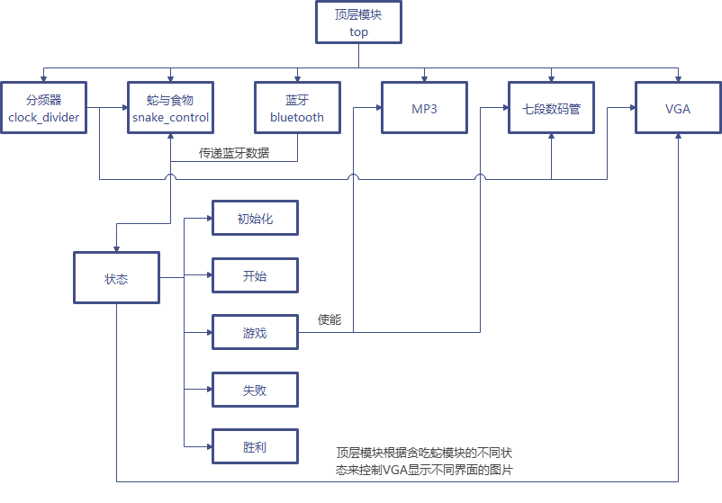

**具体实现细节介绍请见实验报告**

## 实验效果

### Schematic

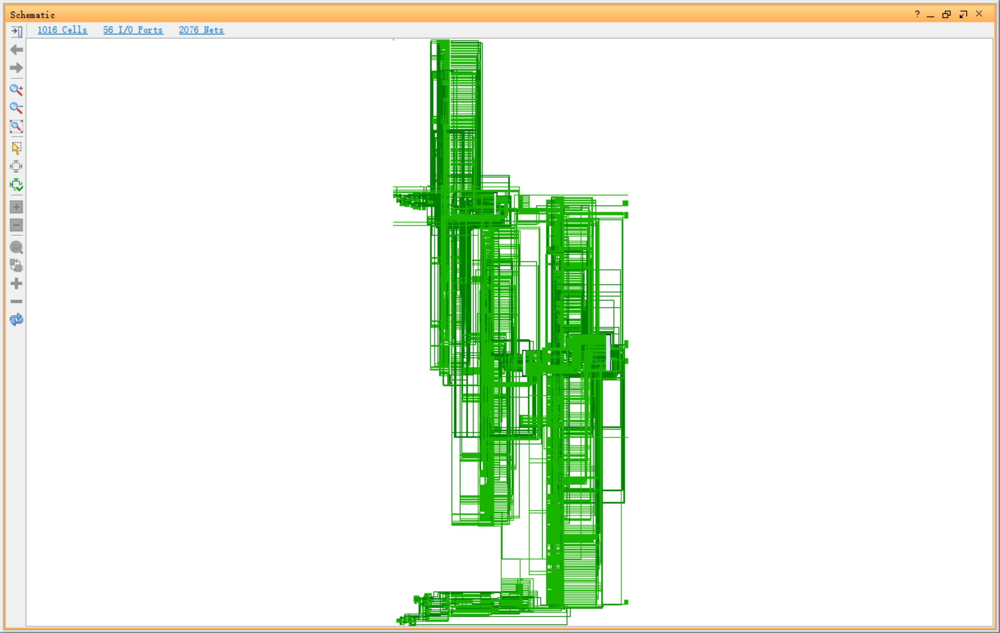

### 开始界面

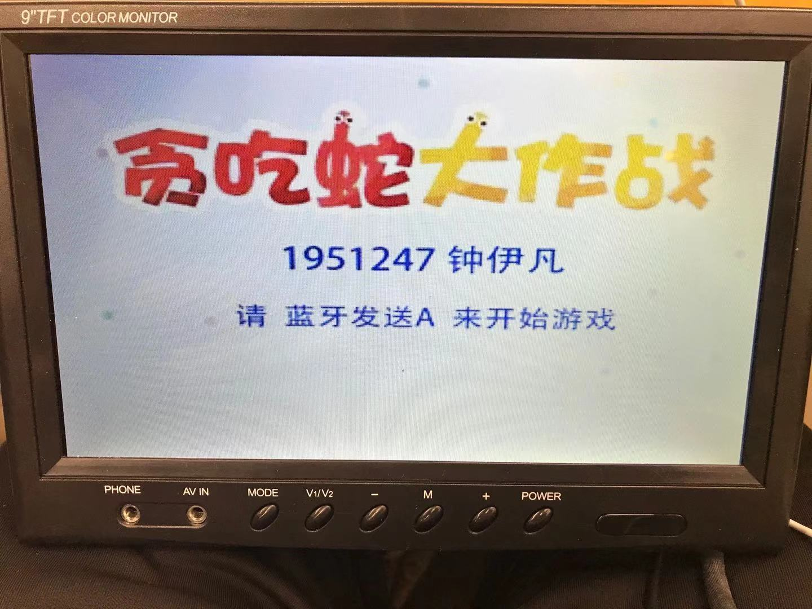

### 游戏界面

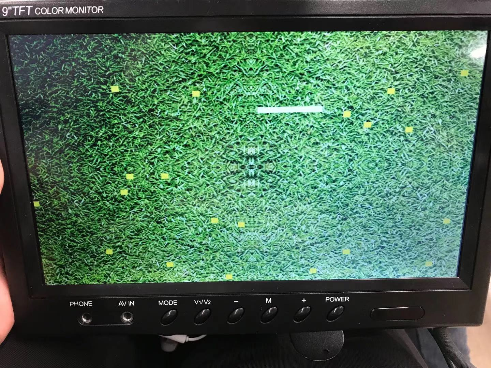

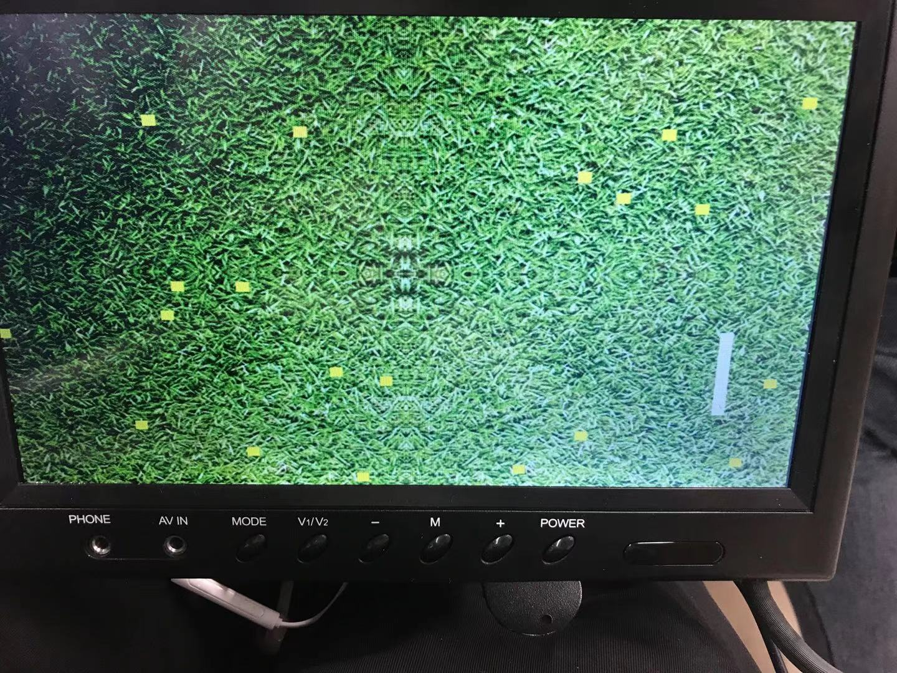

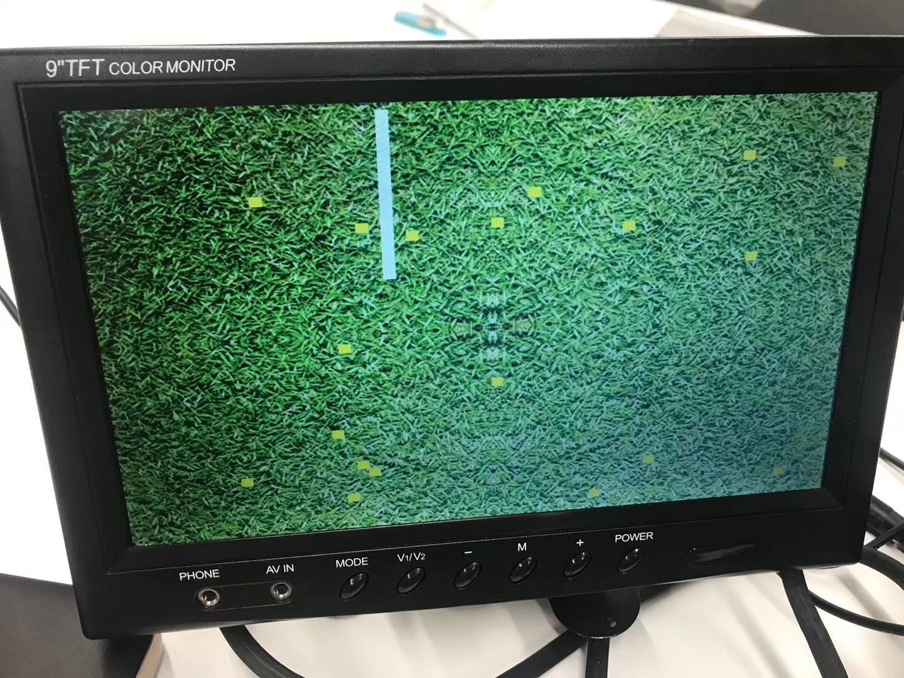

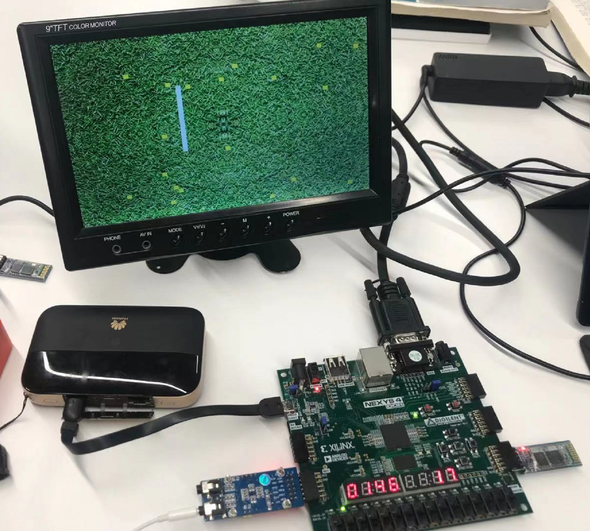

### 失败界面

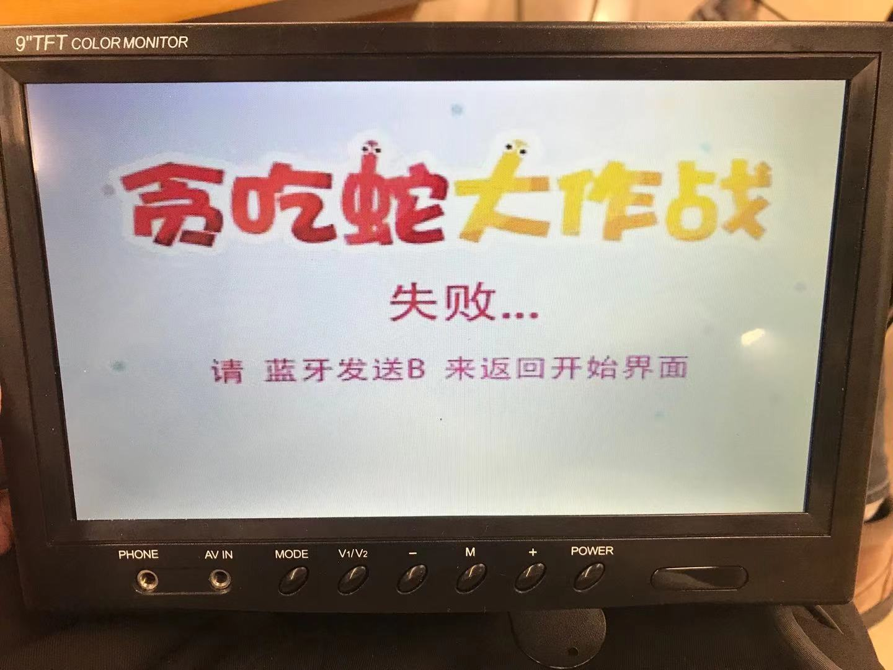

### 胜利界面
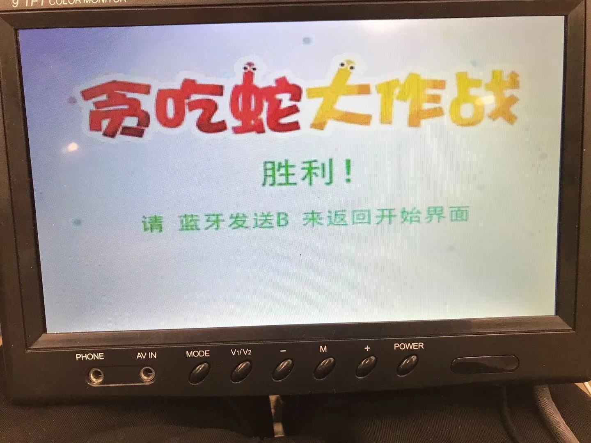